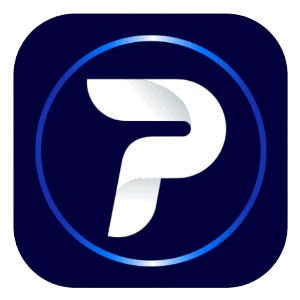

<h1>Protonix</img></h1> 

**Protonix** is a project considered to be the heart of the **Airdrop tools** developed by Aura Pixel.

## Features
- Get Telegram App Data API
- AuraHash Dashboard
- Thread Manager
- Automatically retry when a thread crashes

## Telegram apps supports
- Blum
- OKX Racer
- Tomarket
- CryptoRank
- TheYesCoin
